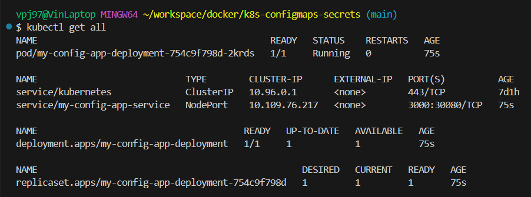
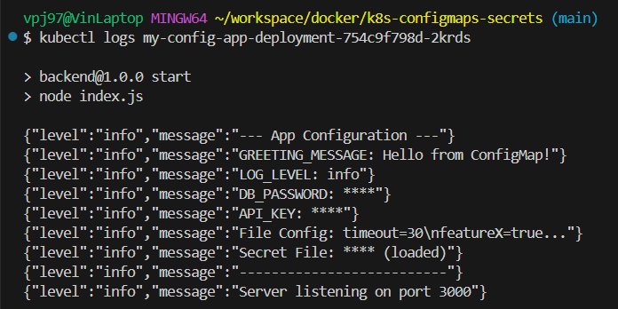

# Kubernetes: ConfigMap & Secret Demo

Dieses Projekt demonstriert, wie Konfigurationsdaten (`ConfigMap`) und sensible Informationen (`Secret`) korrekt in Kubernetes verwendet werden, um eine konfigurierbare Node.js-Anwendung bereitzustellen.

Ziel ist es, die Trennung von Code und Konfiguration nach dem 12-Factor-Prinzip umzusetzen – mit Best Practices für Sicherheit und Wartbarkeit.

---

## Projektstruktur

```txt
.
├── backend/                   # Node.js App
│   ├── Dockerfile
│   ├── index.js
│   ├── package.json
│   └── package-lock.json
├── kubernetes/               # K8s Manifeste
│   ├── app-configmap.yaml
│   ├── app-deployment.yaml
│   ├── app-service.yaml
│   ├── app-secret.example.yaml   # Dummy – sicher im Repo
│   └── app-secret.yaml           # Echt – in .gitignore
├── screenshots/              # Beweisbilder (get, logs)
├── reflexion.md              # Aufgabenreflexion
└── README.md
```

## Anwendung

### 1. Image bauen & pushen

```bash
docker build -t vinjust/my-config-app:latest ./backend
docker push vinjust/my-config-app:latest
```

### 2. Ressourcen deployen

**Hinweis:** Stelle sicher, dass du `app-secret.yaml` lokal hast, aber nicht im Repo.

```bash
kubectl apply -f kubernetes/app-configmap.yaml
kubectl apply -f kubernetes/app-secret.yaml
kubectl apply -f kubernetes/app-deployment.yaml
kubectl apply -f kubernetes/app-service.yaml
```

### 3. Anwendung prüfen

```bash
kubectl get pods
kubectl logs <pod-name>
```

Dann im Browser öffnen:
http://localhost:30080

## Hinweis zu Secrets

Die Datei `kubernetes/app-secret.yaml` enthält sensible Daten (Passwort, API-Key, credentials.txt) und wird deshalb nicht im Repository mitgeführt.

Stattdessen enthält das Repo:
- `app-secret.example.yaml` – zeigt die Struktur, aber mit Platzhalterdaten
- `.gitignore` – schützt die echte Datei vor versehentlichem Commit

## Screenshots

Im Ordner `screenshots/` findest du:

- `resources.png` – zeigt kubectl get mit allen Komponenten
  

- `logs.png` – zeigt, dass ConfigMap und Secret korrekt verarbeitet wurden
  

## Reflexion

Die Beantwortung der Aufgabenfragen findest du in [`reflexion.md`](reflexion.md).